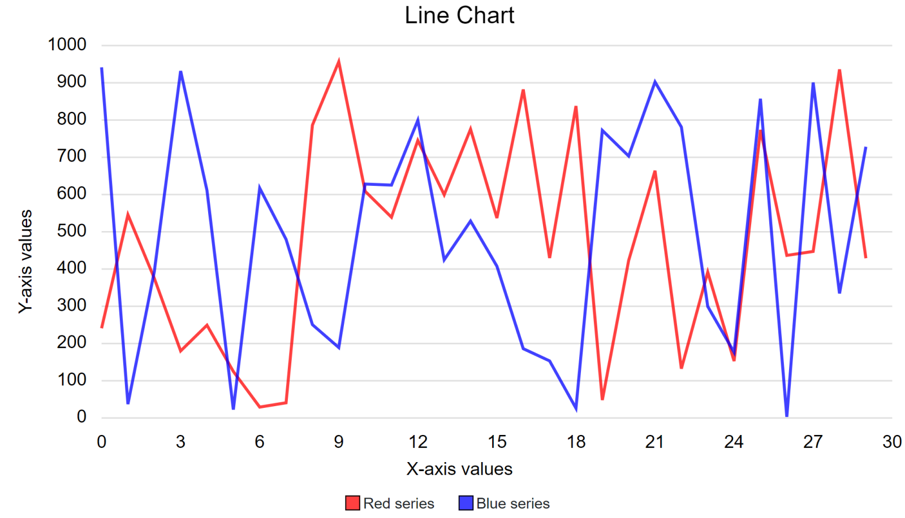
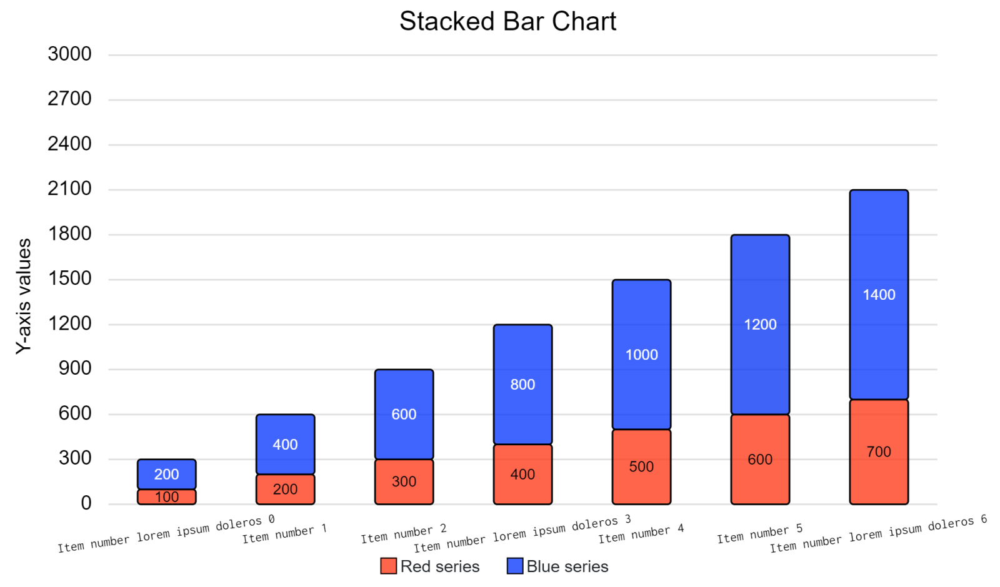

# BlazorCharts
## SVG based charting library for Blazor.
Library has support for
- Line chart
- Scatter chart
- Stacked bar chart

All charts work by initializing the corresponding Series-class from BlazorCharts.PlotDataModels namespace and following the constructors. Then just pass the object to the corresponding chart parameters.

Scatter and stacked bar chart support hover tooltips.

You can find examples in the BlazorCharts.Client project.

## Examples
Scatter chart:

Line chart:

Stacked bar chart:

